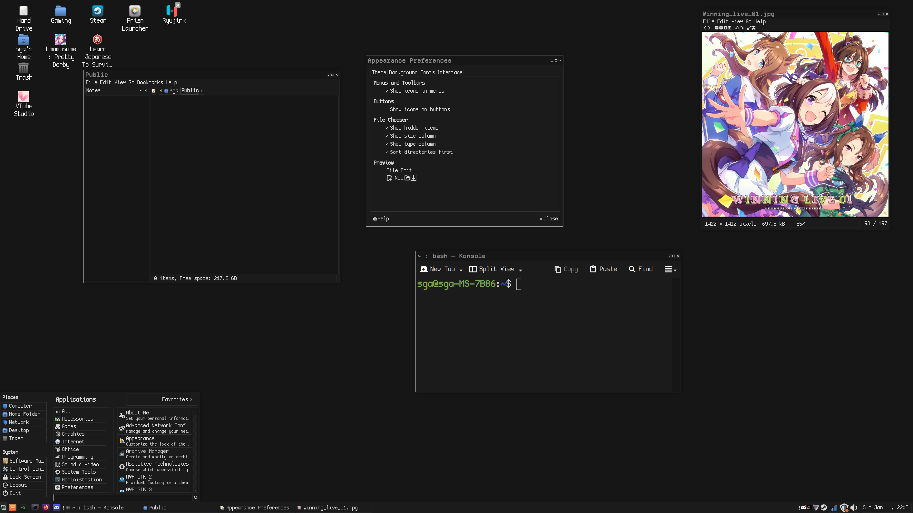
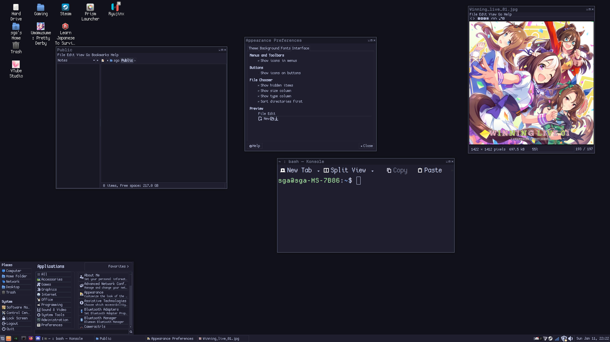

**PENDING UPDATE**

# Nashville96 Alt Colors

More versions of [Nashville96](https://github.com/donfaustinocortizone/Nashville96), originally made by [donfaustinocortizone](https://github.com/donfaustinocortizone). As of <b>December 2025</b>, the original theme is considered archived and I am not going to take over development.
 Based on the borderless versions, the bordered version you can easily copy the og themes for that. I'm also using this on Linux Mint MATE so I cannot guaranteed that this will work on other DEs

### Screenshots

	<b>Generic Dark</b>
	
		<b><a href="https://github.com/catppuccin/catppuccin">Catppuccin Mocha<a/></b>
	
	

## Blank Assets
If you want to create your own flavors of Nashville96, I made 'blank' versions of the images included to make it easier to edit them into your desired colors. They'll be in the "Blank Assets" folder above.

### License 
GNU General Public License v3.0
